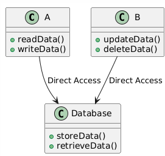

# Primera Evaluación II-2024

### Asignatura: Patrones de Software y Programación   Profesor: Daniel San Martín
Nombre Estudiante: 

### Resultados de Aprendizaje

1.	Aplicar patrones de diseño para crear un software de acuerdo a estándares de seguridad y desempeño
2.  Caracterizar patrones de diseño de acuerdo a su nivel de aplicabilidad a los problemas.

### Enunciado

Una empresa de gestión de eventos necesita desarrollar un sistema para administrar sus actividades. 
El sistema debe permitir registrar eventos (conciertos, conferencias, etc.), sus detalles (nombre, fecha, lugar) y 
los asistentes interesados. Además, cada vez que los detalles de un evento se actualicen, los asistentes interesados 
deben ser notificados.

El sistema actual ya tiene una estructura básica implementada, pero tiene algunos problemas de diseño que dificultan 
su mantenimiento y extensión. El código que se proporciona permite:

1. Eliminar un Evento para un determinado Asistente
2. Ingresar un nuevo Evento
3. Asociar un Evento con un Asistente
4. Actualizar datos de un Evento

Los métodos que manejan estas tareas están fuertemente acoplados entre sí. Además, los cuatro requerimientos 
están codificados en una clase **Main**, lo que dificulta el entendimiento, ya que el programador requiere
conocer los por menores de implementación (por ejemplo, el cómo usar JPA/Hibernate).

Se le pide que refactorice el código para mejorar su diseño y calidad, implementando 2 patrones de diseño 
para: 
 1. Asegurar que las responsabilidades estén mejor distribuidas; 
 2. que el código sea más mantenible y escalable en relación a las notificaciones y al código que permite ejecutar las cuatro funcionalidades; 
 3. Crear el diagrama de clases de su solución con el programa Visual Paradigm, (https://tinyurl.com/5bbn7mda), hacer 
un screenshot y adjuntarlo en la carpeta _imagenes_ que se encuentra en la raiz de este proyecto.

### Consideraciones

1. Los datos manipulados por el sistema vienen de una base de datos SQLite llamada _basedatos.db_,
y por lo tanto no necesita adicionar nuevos datos. 
2. Si crea nuevos métodos que estos sean parametrizables si corresponde.
3. Al terminar de ejecutar el programa, se creará un archivo llamado _informaciones.log_,
el cual contiene los asistentes y eventos relacionados. Las modificaciones que usted
haga deben preservar la información de este archivo.

### Preguntas (Parte 1) (65%)

1. ¿Cuales patrones de diseño son los adecuados para dar solución al problema de implementación?. Escriba una breve explicación (**10pts**).
2. ¿Cuales son las propiedades y principios de diseño que atienden los patrones escogidos?. Escriba una breve explicación. (**10pts**)

### Preguntas (Parte 2) (35%)

1. ¿Cuál de las siguientes afirmaciones describe mejor el patrón de diseño Template Method? (**18pts**)
   1. Es un patrón de diseño estructural que permite que los objetos cambien su comportamiento en tiempo de ejecución.
   2. Es un patrón de diseño de comportamiento que define la estructura de un algoritmo en una clase base y permite que 
   las subclases personalicen ciertos pasos sin cambiar la estructura general.
   3. Es un patrón de diseño creacional que se utiliza para crear objetos complejos paso a paso.
   4. Es un patrón de diseño de comportamiento que permite que un objeto notifique a otros objetos cuando cambian sus estados.
   
   **Explique su solución con un breve ejemplo sin entrar en detalles de código.**
2. Dado el siguiente diagrama de clases:

Explique brevemente que está ocurriendo en el diagrama de clases, desde el punto de vista de las propiedades de diseño (**20pts**).

### Rúbrica de Evaluación Implementación: Refactorización del Sistema de Gestión de Eventos

| **Criterios**                                           | **Nivel 1 (1-2 puntos)**                                                                 | **Nivel 2 (3-4 puntos)**                                                                 | **Nivel 3 (5-6 puntos)**                                                                 | **Nivel 4 (7 puntos)**                                                                  |
|---------------------------------------------------------|------------------------------------------------------------------------------------------|------------------------------------------------------------------------------------------|------------------------------------------------------------------------------------------|------------------------------------------------------------------------------------------|
| **Aplicación de patrones de diseño (RA 1)**             | No aplica patrones de diseño o los aplica incorrectamente.                               | Aplica patrones de diseño básicos, pero sin mejoras claras en el mantenimiento o escalabilidad. | Aplica correctamente uno o más patrones de diseño adecuados, con mejoras visibles.        | Aplica varios patrones de diseño de forma efectiva, mejorando claramente el mantenimiento, escalabilidad y calidad del sistema. |
| **Distribución de responsabilidades**                   | No distribuye responsabilidades entre las clases; el código sigue siendo muy acoplado.    | Distribuye responsabilidades parcialmente, pero aún con acoplamiento elevado.             | La distribución de responsabilidades mejora, con menor acoplamiento y mejor cohesión.     | Excelente distribución de responsabilidades, logrando un código desacoplado y fácil de entender. |
| **Caracterización de patrones (RA 2)**                  | No logra identificar ni caracterizar patrones de diseño en el contexto del problema.      | Identifica algunos patrones, pero con comprensión limitada de su aplicabilidad.           | Caracteriza correctamente uno o más patrones en función del problema planteado.          | Caracteriza y justifica adecuadamente la aplicabilidad de los patrones usados para resolver el problema de manera eficiente. |
| **Cumplimiento de los requisitos funcionales**          | No cumple con los requisitos funcionales básicos del sistema.                            | Cumple parcialmente con los requisitos, pero con errores o incompletos.                  | Cumple con la mayoría de los requisitos funcionales correctamente.                       | Cumple con todos los requisitos funcionales del sistema sin errores.                     |
| **Calidad del código (mantenibilidad, escalabilidad)**  | El código sigue siendo difícil de mantener o escalar; muy acoplado.                      | El código mejora ligeramente en cuanto a mantenibilidad, pero aún presenta alto acoplamiento. | El código es notablemente más mantenible y escalable, con una clara separación de responsabilidades. | El código es altamente mantenible y escalable, con una excelente separación de responsabilidades y bajo acoplamiento. |
| **Notificaciones y cambios de estado**                  | El sistema no maneja notificaciones ni reacciona adecuadamente a cambios de estado.       | Implementa notificaciones básicas, pero con una gestión de cambios de estado limitada.    | Maneja correctamente las notificaciones y actualizaciones del estado del sistema.        | Implementa un mecanismo de notificaciones eficaz, con una gestión de cambios de estado clara y eficiente. |
Un máximo de **42** puntos.

Buena suerte!

## Respuestas

(comienze a escribir aquí sus respuestas, indicando sección y número de pregunta)